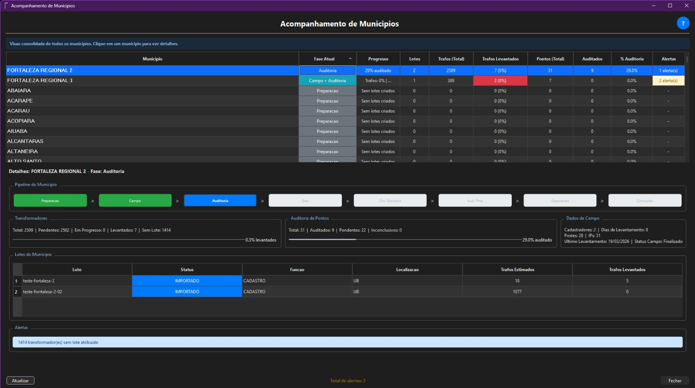
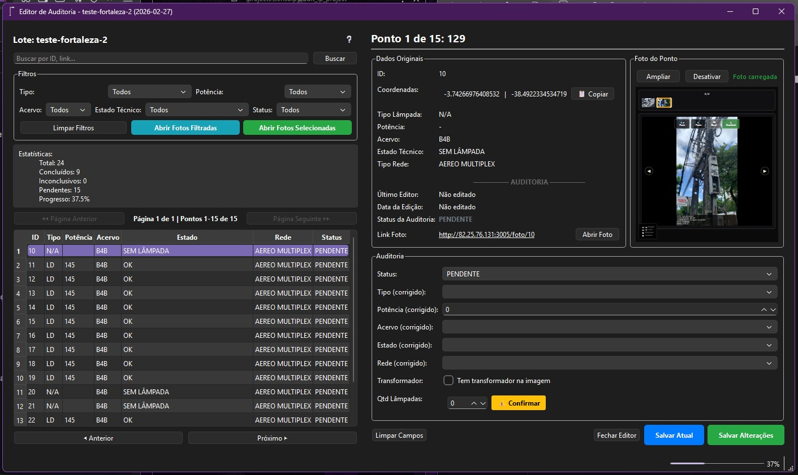
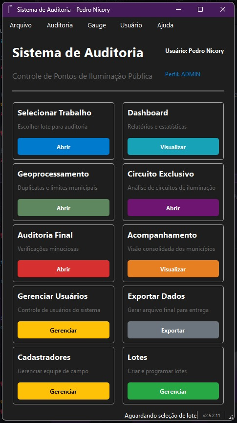

# censo_ip
CensoIP Desktop is a professional-grade management and audit platform for **Public Lighting (IP)** inventories. Designed for municipalities, concessionaires, and engineering firms, it replaces error-prone manual Excel/VBA workflows with a robust, cloud-connected desktop application.
<p align="center">
  
</p>

<h1 align="center">CensoIP Desktop</h1>

<p align="center">
  <strong>Professional Public Lighting Audit & Management System</strong><br/>
  <em>From the field to the final report — all in one place.</em>
</p>

<p align="center">
  
  
  
  
  
</p>

---

## 🇬🇧 English

### What is CensoIP Desktop?

CensoIP Desktop is a professional-grade management and audit platform for **Public Lighting (IP)** inventories. Designed for municipalities, concessionaires, and engineering firms, it replaces error-prone manual Excel/VBA workflows with a robust, cloud-connected desktop application.

The system is the central hub of the CensoIP ecosystem — it receives field data collected by the [CensoIP Mobile](https://github.com/nicoryy/censoip-mobile) app, and transforms it into audited, verified, and exportable reports.

---

### The Problem It Solves

Managing a public lighting census manually — using spreadsheets, VBA macros, and shared files — is a recipe for disaster:

- **Data loss**: Shared Excel files break, get overwritten, or become corrupted
- **No collaboration**: Only one person can work at a time; changes conflict constantly
- **Zero traceability**: No record of who changed what, when, or why
- **Slow process**: Manual cross-referencing, copy-paste, and formula-based validation are error-prone and time-consuming
- **No geographic analysis**: Spreadsheets can't detect duplicate GPS points or spatial conflicts

CensoIP Desktop was built to solve all of these problems — simultaneously, at scale.

---

### Key Features

#### Audit Workflow
- Intelligent point locking — multiple auditors work without conflicts
- Batch editing — update hundreds of points in seconds
- Paginated view with 100 points/page for smooth performance
- Advanced filtering by status, type, transformer, auditor, and more
- Auto-save every 30 seconds to prevent data loss

#### Geoprocessing
- Automatic duplicate detection based on GPS proximity
- Collaborative duplicate review with visual side-by-side comparison
- Spatial conflict resolution tools

#### Final Audits
- Transformer circuit validation
- Points without lamps, unproductive points, broken/burned lamps
- Exclusive circuit analysis

#### Excel Export
- **BASE ORIGINAL**: Raw field data
- **BASE TRATADA**: Processed data with business rules applied
- **VERIFICAÇÕES**: Validation flags
- **EXCLUÍDOS**: Discarded records
- **CIRCUITO EXCLUSIVO**: Special circuit data
- **MEDIDORES / DERIVAÇÕES**: Meters and branches

#### Multi-User Collaboration
- Cloud database (Supabase/PostgreSQL)
- Multiple machines, simultaneous access, zero conflicts
- Complete audit log of every change

#### Embedded Map
- Internal map viewer via Flask integration
- Visual inspection of georeferenced points directly in the desktop

---

### Tech Stack

| Layer | Technology |
|-------|-----------|
| Desktop UI | PyQt6 |
| ORM | SQLAlchemy |
| Embedded Map | Flask + Leaflet.js |
| Database | PostgreSQL via Supabase |
| Storage | Supabase Storage |
| Auth | Supabase Auth + JWT |
| Distribution | PyInstaller (`.exe`) |

---

### System Architecture

```
CensoIP Mobile (Field Collection)
          ↓
   Supabase PostgreSQL
          ↓
  CensoIP Desktop (Management & Audit)
          ↓
    Excel Export / Reports
```

---

### Screenshots

<p align="center">
  
  
  
</p>

---

### License

This software is **commercially licensed**. All rights reserved.
Unauthorized copying, distribution, or modification is strictly prohibited.

**Developed by** [Pedro Nicory](https://nicoryy.com)

---
---

## 🇧🇷 Português

### O que é o CensoIP Desktop?

O CensoIP Desktop é uma plataforma profissional de gestão e auditoria de inventários de **Iluminação Pública (IP)**. Desenvolvido para municípios, concessionárias e empresas de engenharia, ele substitui os processos manuais em Excel/VBA por uma aplicação desktop robusta e conectada à nuvem.

O sistema é o centro do ecossistema CensoIP — recebe os dados coletados em campo pelo app [CensoIP Mobile](https://github.com/nicoryy/censoip-mobile) e os transforma em relatórios auditados, verificados e prontos para exportação.

---

### O Problema que Resolve

Gerenciar um censo de iluminação pública manualmente — com planilhas, macros VBA e arquivos compartilhados — é uma fonte contínua de erros e retrabalho:

- **Perda de dados**: Arquivos Excel compartilhados corrompem, são sobrescritos ou desaparecem
- **Sem colaboração real**: Apenas uma pessoa trabalha por vez; conflitos de edição são constantes
- **Sem rastreabilidade**: Nenhum histórico de quem alterou o quê, quando ou por quê
- **Processo lento**: Cruzamentos manuais, copia-e-cola e fórmulas complexas são lentos e propícios a erro
- **Sem análise geográfica**: Planilhas não detectam pontos GPS duplicados nem conflitos espaciais

O CensoIP Desktop foi construído para resolver todos esses problemas — ao mesmo tempo, em escala.

---

### Funcionalidades Principais

#### Fluxo de Auditoria
- Bloqueio inteligente de pontos — múltiplos auditores trabalham sem conflito
- Edição em lote ultra-rápida — centenas de pontos atualizados em segundos
- Visualização paginada (100 pontos/página) para performance suave
- Filtros avançados por status, tipo, transformador, auditor e mais
- Auto-save a cada 30 segundos para evitar perda de dados

#### Geoprocessamento
- Detecção automática de duplicatas por proximidade GPS
- Revisão colaborativa de duplicatas com comparação visual lado a lado
- Ferramentas de resolução de conflitos espaciais

#### Auditorias Finais
- Validação de circuitos de transformadores
- Pontos sem lâmpada, improdutivos, quebrados/queimados
- Análise de Circuito Exclusivo

#### Exportação Excel
- **BASE ORIGINAL**: Dados brutos do campo
- **BASE TRATADA**: Dados processados com regras de negócio aplicadas
- **VERIFICAÇÕES**: Flags de validação
- **EXCLUÍDOS**: Registros descartados
- **CIRCUITO EXCLUSIVO**: Dados de circuito especial
- **MEDIDORES / DERIVAÇÕES**: Medidores e ramais

#### Colaboração Multi-Usuário
- Banco de dados em nuvem (Supabase/PostgreSQL)
- Múltiplas máquinas com acesso simultâneo, sem conflitos
- Log de auditoria completo de cada alteração

#### Mapa Integrado
- Visualizador de mapa interno via integração Flask
- Inspeção visual dos pontos georreferenciados diretamente no desktop

---

### Stack Tecnológica

| Camada | Tecnologia |
|--------|-----------|
| Interface Desktop | PyQt6 |
| ORM | SQLAlchemy |
| Mapa Integrado | Flask + Leaflet.js |
| Banco de Dados | PostgreSQL via Supabase |
| Armazenamento | Supabase Storage |
| Autenticação | Supabase Auth + JWT |
| Distribuição | PyInstaller (`.exe`) |

---

### Arquitetura do Sistema

```
CensoIP Mobile (Coleta em Campo)
          ↓
   Supabase PostgreSQL
          ↓
  CensoIP Desktop (Gestão e Auditoria)
          ↓
    Exportação Excel / Relatórios
```

---

### Capturas de Tela

<p align="center">
  
  
  
</p>

---

### Licença

Este software possui **licença comercial**. Todos os direitos reservados.
Cópia, distribuição ou modificação não autorizada é estritamente proibida.

**Desenvolvido por** [Pedro Nicory](https://nicoryy.com)
